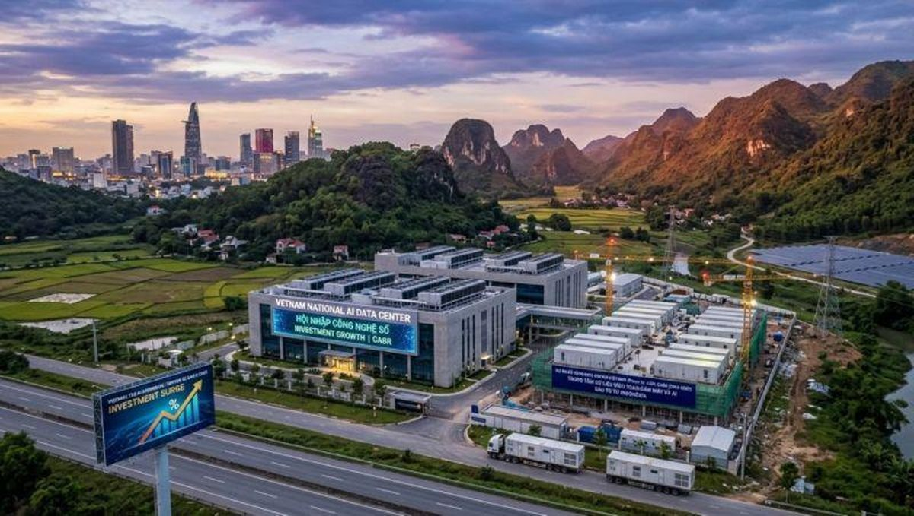

In the global semiconductor industry, most people think of Silicon Valley, Taiwan, South Korea, or Tokyo when they hear the words "chip design" and "advanced technology." Yet innovation does not only belong to the largest cities or the biggest corporations. Sometimes, the best place to build the future is a place filled with peace, focus, resilience, and human potential.

That is why Quy Nhon Semiconductor Company (QNSC) was established in Quy Nhơn, Vietnam.

## A Different Vision for Semiconductor Innovation

QNSC is a fabless semiconductor startup focused on advanced chip design, AI infrastructure technologies, and next-generation system architecture. Our vision is not only to build technology products, but also to help develop long-term engineering talent and contribute to Vietnam's growing high-tech ecosystem.

We believe Vietnam can become an important part of the global semiconductor supply chain over the next decade. The country has strong young talent, hardworking engineers, competitive operating costs, and a new generation eager to learn advanced technologies such as AI, ASIC design, system architecture, and high-performance computing.

> The challenge is not talent. The challenge is leadership, mentorship, experience, and opportunity.
> That is where QNSC hopes to contribute.

## Why Quy Nhơn?

Quy Nhơn, my hometown on Vietnam's beautiful central coast, has recently become part of the newly expanded Gia Lai Province under Vietnam's administrative reorganization. While the governance structure has changed, the spirit, culture, and memories of Quy Nhơn remain deeply rooted in who we are.

For me personally, Quy Nhơn is more than a former city name. It is my hometown — the place where I grew up, learned life's early lessons, and graduated from Trung Vương High School in 1979.

Life later took me across the world, into the semiconductor and high-tech industry in the United States. Over the past four decades, I have been fortunate to work in advanced hardware engineering, semiconductor technology, large-scale infrastructure systems, AI platforms, and global manufacturing ecosystems — IBM, NetApp, Facebook/Meta, and TORmem.

But no matter where life goes, your roots remain important. Establishing QNSC in Quy Nhơn, Gia Lai Province is to help create opportunities for the next generation of Vietnamese engineers and innovators.

## Vietnam's Opportunity in Semiconductors and AI

The world is entering a new era driven by artificial intelligence, advanced computing, and semiconductor technologies. Every AI system, cloud platform, neocloud, autonomous system, and smart device depends on advanced chips and infrastructure.

Vietnam is now standing at an important moment in history. Global companies are diversifying supply chains. Governments and enterprises are investing heavily in semiconductor ecosystems. The demand for engineers and chip design expertise continues to grow rapidly worldwide.

Vietnam has several important advantages:

- A young and motivated engineering workforce
- Strong mathematics and technical education foundations
- Competitive operational costs
- Growing global partnerships
- Strategic geographic position in Asia
- Increasing government support for high-tech industries

Most importantly, Vietnam has ambitious young people who are eager to learn and build.

## Knowledge Transfer Matters

Technology is not built only with capital. It is built with experience and a hardworking culture. One of the most valuable things overseas Vietnamese professionals can bring back to the country is real-world knowledge gained from decades of working inside global technology companies and large-scale engineering environments.

> At QNSC, our goal is not simply to build chips.
> Our goal is to help build people.

We want to mentor engineers, develop practical semiconductor design skills, and expose young talent to global engineering standards in areas such as:

- Semiconductor chip design
- Physical layout and ASIC development
- AI infrastructure systems
- High-performance computing
- Hardware and software integration
- Product engineering and manufacturing processes
- Data center architecture and next-generation computing platforms

Vietnam does not need to wait 20 more years to participate in advanced technology industries. With the right leadership, partnerships, and commitment, Vietnam can accelerate much faster.

## Building Quietly, Building Seriously

QNSC is not trying to become the loudest company. We simply want to build meaningful technology with long-term value. Real innovation requires patience, discipline, and execution.

Quy Nhơn may be quieter than larger cities, but sometimes quiet places create the strongest focus. Great engineers are not measured by how loudly they speak, but by what they build with high quality.

We believe the future semiconductor industry will not belong only to giant corporations. It will also belong to agile startups, determined engineers, and visionary young teams willing to work hard and think globally.

## Looking Forward

The journey ahead will not be easy. Semiconductor and AI industries are among the most difficult fields in the world. But difficult things are worth pursuing.

QNSC was established in Quy Nhơn because we believe world-class innovation can grow from anywhere when talent, vision, and determination come together.

**Why Quy Nhơn?**
Because great things can come from peaceful places.

**Why Vietnam?**
Because the next generation of Vietnamese engineers deserves the opportunity to help shape the future of global technology.

— Thao Nguyen
